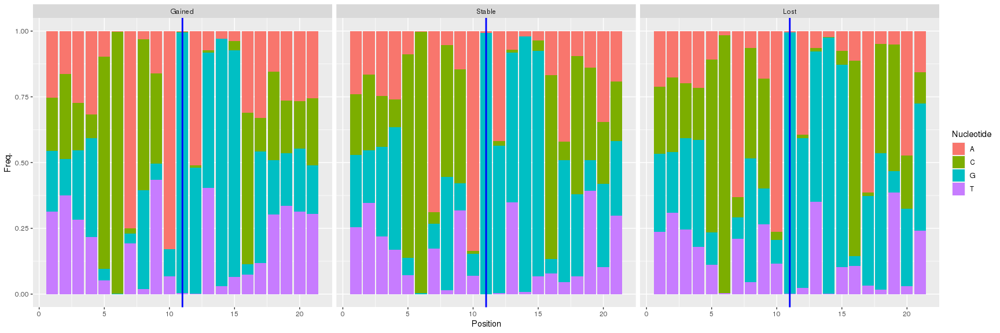
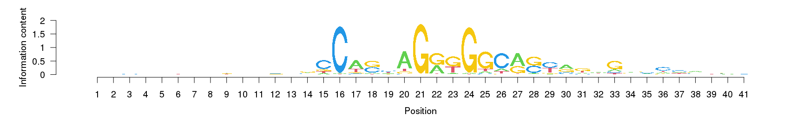

  

# Overview

The previous report, "(2)Motif_discovery_rGADEM.html", has shown that the most significant motif indentified in each of the three clusters, **Gained**, **Lost** and **Stable**, is the canonical CTCF motif. In this report, I will look into these identified CTCF-like censensus in each cluster and compare their binding site orientation, and their nucleotide distribution in windows with different lengths centered at the mid-point of the canonical CTCF motif, i.e the 10th nucleotide ('G') in the CTCF logo.

<!-- -->

Fig 1: sequence logo of the canonical CTCF motif

# CTCF binding site orientations in the three cluster

Table 1: The proportion of CTCF sequences with different directions (sense or antisense direction) in each of the three clusters. 

------------------------------
   &nbsp;       +        -    
------------ -------- --------
 **Gained**   0.511    0.489  

  **Lost**    0.4994   0.5006 

 **Stable**   0.4977   0.5023 
------------------------------

# Comparing the identified CTCF-like consensus in the three cluster, in a **11 bp** window

<!-- -->

Fig 2:  Nucleotide distribution in a 14bp window centered at the mid-point of the canonical CTCF motif for binding sequences in cluster Gained, stable and lost. The vertical blue line indicates the center which corresponds to the the 10th nucleotide ('G') in Fig 1.

<!-- -->

Fig 3: sequence logo of the CTCF motif identifed in the **Gained** Cluster

<!-- -->

Fig 4: sequence logo of the CTCF motif identifed in the **Stable** Cluster

<!-- -->

Fig 5: sequence logo of the CTCF motif identifed in the **Loss** Cluster

# Comparing the identified CTCF-like consensus in the three cluster, in a **21 bp** window

In this section, I will look into the identified CTCF-like censensus in the *Gained*, *Lost*, and *Stable* cluster and compare their binding site orientation, and their nucleotide distribution in a longer window (21bp) centered at the mid-point of the canonical CTCF motif, i.e the 10th nucleotide ('G') in the CTCF logo in Fig. 1.

<!-- -->

Fig 6: Necleotide distribution in a 21bp window centered at the mid-point of the canonical CTCF motif for binding sequences in cluster Gained, stable and lost. The vertical blue line indicates the center which corresponds to the 10th nucleotide ('G') in Fig 1.

<!-- -->

Fig 7: sequence logo of the CTCF motif identifed in the **Gained** Cluster

<!-- -->

Fig 8: sequence logo of the CTCF motif identifed in the **Stable** Cluster

<!-- -->

Fig 9: sequence logo of the CTCF motif identifed in the **Lost** Cluster

# Comparing the identified CTCF-like consensus in the three cluster, in a **41 bp** window

<!-- -->

Fig 10: Necleotide distribution in a 61bp window centered at the mid-point of the canonical CTCF motif for binding sequences in cluster Gained, stable and lost. The vertical blue line indicates the center which corresponds to the 10th nucleotide ('G') in Fig 1.

<!-- -->

Fig 11: sequence logo of the CTCF motif identifed in the **Gained** Cluster

<!-- -->

Fig 12: sequence logo of the CTCF motif identifed in the **Stable** Cluster

<!-- -->

Fig 13: sequence logo of the CTCF motif identifed in the **Lost** Cluster

# Comparing the identified CTCF-like consensus in the three cluster, in a **61 bp** window

<!-- -->

Fig 14: Necleotide distribution in a 61bp window centered at the mid-point of the canonical CTCF motif for binding sequences in cluster Gained, stable and lost. The vertical blue line indicates the center which corresponds to the 10th nucleotide ('G') in Fig 1.

<!-- -->

Fig 15: sequence logo of the CTCF motif identifed in the **Gained** Cluster

<!-- -->

Fig 16: sequence logo of the CTCF motif identifed in the **Stable** Cluster

<!-- -->

Fig 17: sequence logo of the CTCF motif identifed in the **Lost** Cluster

# Frequency differences

## **Lost** v.s. **Stable**

<!-- -->

Fig 18: Difference of nucleotide differences between the **Lost** and **Stable** clusters. Black dashed lines (at position 25 and 48) are the boundaries of the region with frequency differences greater than 10% between the Lost cluster and the stable cluster

Table: Nucleotide frequences at positions with Freq. differences greater than 10% between the **Lost** and **Stable** clusters.

--------------------------------------------------------------------------------
 Nucleotide   Position   Gained   Stable    Lost    lost-stable   Gained-stable 
------------ ---------- -------- -------- -------- ------------- ---------------
     G           43      0.188    0.3939   0.6458     0.2519         -0.2059    

     G           38      0.2077   0.3118   0.5189     0.2071         -0.1041    

     G           41      0.1862   0.2821   0.4827     0.2006        -0.09588    

     A           37      0.3295   0.4201   0.6145     0.1944        -0.09063    

     C           46      0.1638   0.3537   0.5269     0.1732         -0.1899    

     C           39      0.2005   0.3528   0.4819     0.1291         -0.1523    

     A           40      0.2659   0.3459   0.4739      0.128        -0.07996    

     G           37      0.4235   0.4638   0.3406     -0.1232        -0.0403    

     C           25      0.8057   0.7729   0.657      -0.1159        0.0328     

     C           38      0.3348   0.5266   0.4145     -0.1122        -0.1918    

     A           44      0.2856   0.2105   0.3205      0.11          0.07511    

     C           41      0.2534   0.2279   0.1197     -0.1083        0.02541    
--------------------------------------------------------------------------------

## **Gained** v.s. **Stable**

<!-- -->

Fig 19: Difference of nucleotide differences between the **Lost** and **Stable** clusters. Black dashed lines (at position 33 and 47) are the boundaries of the region with frequency differences greater than 10% between the Gained cluster and the Stable cluster.

Table: Nucleotide frequences at positions with Freq. differences greater than 10% between the Gained cluster and the Stable cluster.

----------------------------------------------------------------------------------
 Nucleotide   Position   Gained   Stable     Lost     lost-stable   Gained-stable 
------------ ---------- -------- --------- --------- ------------- ---------------
     T           38      0.3026   0.06725   0.01687    -0.05038        0.2353     

     T           40      0.3133   0.1022    0.02972    -0.07246        0.2112     

     G           43      0.188    0.3939    0.6458      0.2519         -0.2059    

     C           38      0.3348   0.5266    0.4145      -0.1122        -0.1918    

     C           46      0.1638   0.3537    0.5269      0.1732         -0.1899    

     C           45      0.1782   0.3511    0.3245     -0.02659        -0.1729    

     G           46      0.3098   0.1572    0.1382     -0.01905        0.1526     

     C           39      0.2005   0.3528    0.4819      0.1291         -0.1523    

     A           36      0.3098   0.1677    0.1124     -0.05524        0.1421     

     G           47      0.3187   0.1825    0.1157     -0.06687        0.1362     

     A           39      0.2641    0.138    0.0506     -0.08739        0.1261     

     C           36      0.5765   0.6996    0.7422      0.04261        -0.123     

     C           47      0.1961   0.3162    0.4153      0.0991         -0.1201    

     T           29      0.4342    0.317    0.2651     -0.05197        0.1172     

     G           38      0.2077   0.3118    0.5189      0.2071         -0.1041    
----------------------------------------------------------------------------------

## Nucleotide frequencies in a **24 bp** window (this region has Freq. differences greater than 10%)

<!-- -->

Fig 20: Necleotide distribution in a window for binding sequences in cluster Gained, stable and lost. The vertical blue line indicates the center which corresponds to the 10th nucleotide ('G') in Fig 1.

<!-- -->

Fig 21: sequence logo of the CTCF motif identifed in the **Gained** Cluster

<!-- -->

Fig 22: sequence logo of the CTCF motif identifed in the **Stable** Cluster

<!-- -->

Fig 23: sequence logo of the CTCF motif identifed in the **Lost** Cluster

