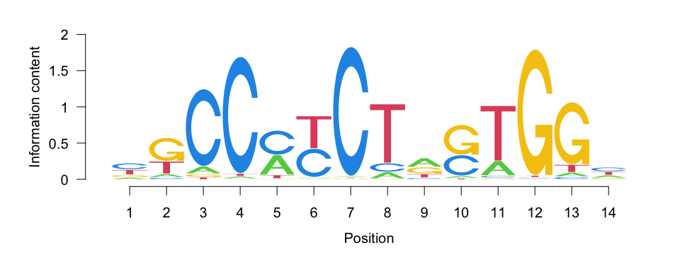
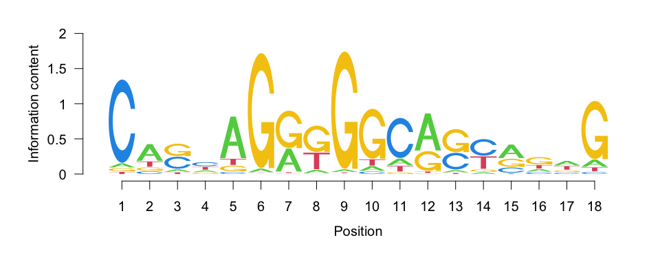
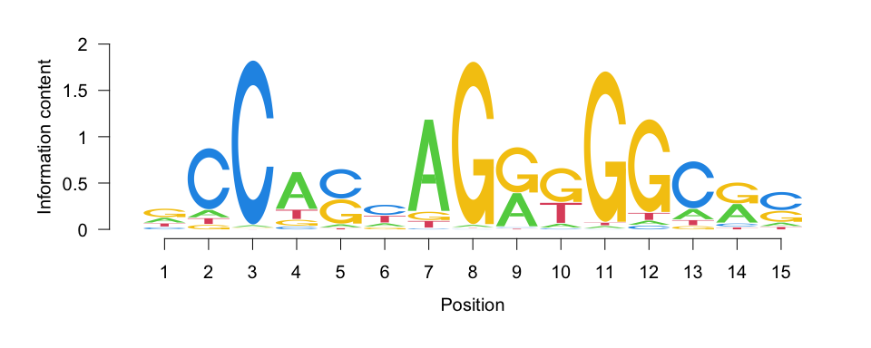
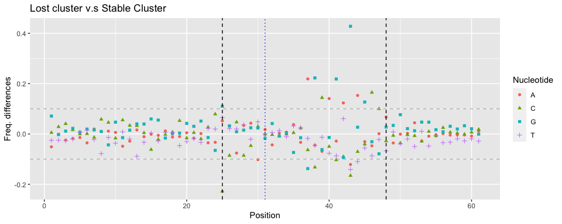
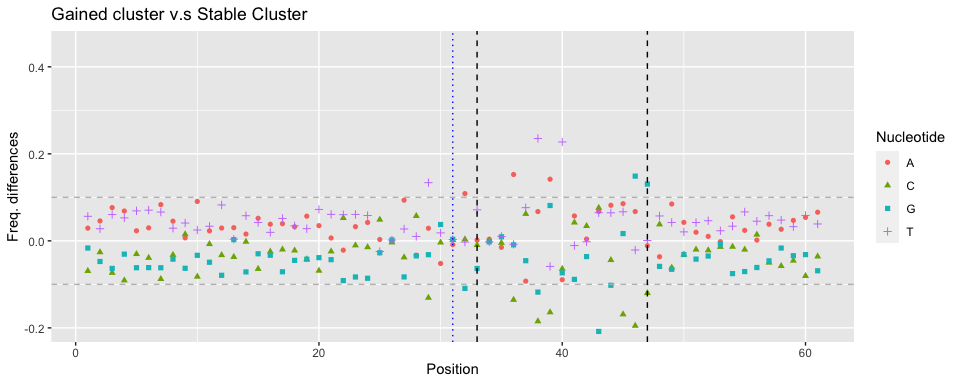
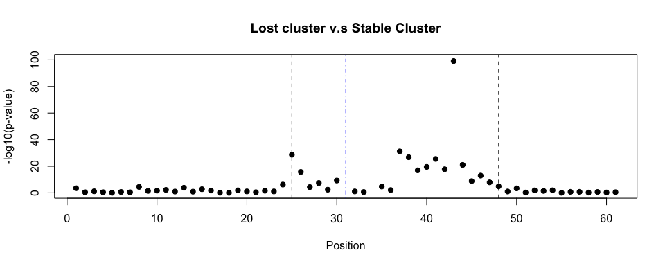
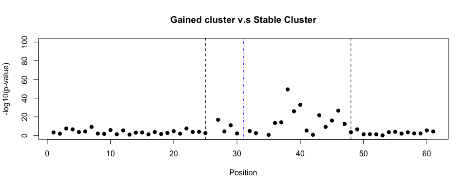
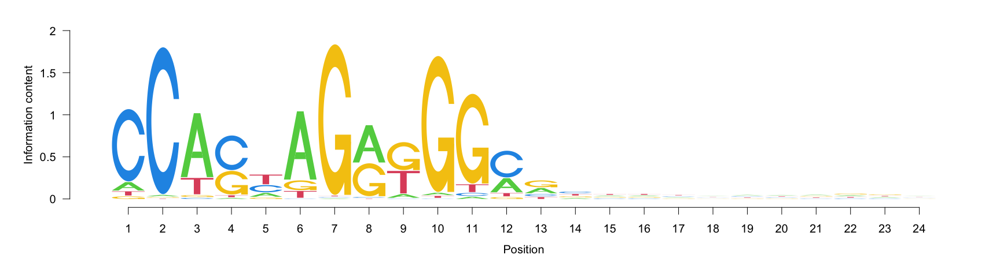
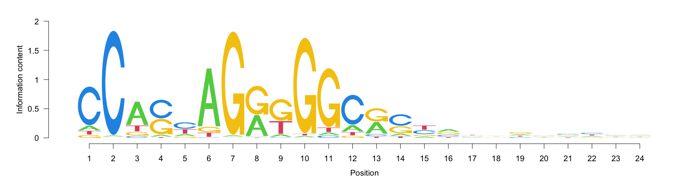
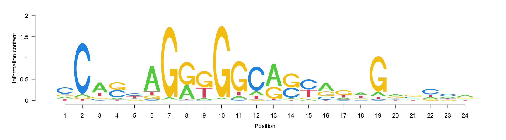

  


Motif identified in the Gained cluster

<!-- -->


Motif identified in the Lost cluster
<!-- -->


Motif identified in the Stable cluster
<!-- -->


# Frequency Difference Plot


## **Lost** v.s. **Stable**

<!-- -->

Fig 18: Difference of nucleotide differences between the **Lost** and **Stable** clusters. Black dashed lines (at position 25 and 48) are the boundaries of the region with frequency differences greater than 10% between the Lost cluster and the stable cluster

Table: Nucleotide frequences at positions with Freq. differences greater than 10% between the **Lost** and **Stable** clusters.


```
##    Nucleotide Position     Gained     Stable   Lost lost-stable Gained-stable
## 1           G       43 0.18472652 0.39289240 0.8208   0.4279076  -0.208165877
## 2           C       25 0.82765738 0.77887463 0.5512  -0.2276746   0.048782749
## 3           G       38 0.19711042 0.31490622 0.5376   0.2226938  -0.117795796
## 4           A       37 0.32301342 0.41559724 0.6344   0.2188028  -0.092583820
## 5           G       41 0.18885449 0.27739388 0.4960   0.2186061  -0.088539390
## 6           C       43 0.26934985 0.19348470 0.0280  -0.1654847   0.075865146
## 7           C       46 0.16718266 0.36229023 0.5272   0.1649098  -0.195107565
## 8           A       44 0.29102167 0.20927937 0.3624   0.1531206   0.081742304
## 9           C       39 0.19814241 0.36229023 0.5064   0.1441098  -0.164147812
## 10          T       43 0.26006192 0.19545903 0.0544  -0.1410590   0.064602887
## 11          A       40 0.26212590 0.35143139 0.4920   0.1405686  -0.089305489
## 12          G       37 0.42724458 0.47285291 0.3352  -0.1376529  -0.045608330
## 13          C       38 0.33539732 0.52023692 0.3880  -0.1322369  -0.184839603
## 14          G       45 0.27141383 0.25468904 0.3816   0.1269110   0.016724786
## 15          A       42 0.27760578 0.27344521 0.3968   0.1233548   0.004160567
## 16          A       43 0.28586171 0.21816387 0.0968  -0.1213639   0.067697843
## 17          G       25 0.02992776 0.05725568 0.1672   0.1099443  -0.027327916
## 18          T       44 0.27966976 0.21520237 0.1056  -0.1096024   0.064467393
## 19          C       41 0.26625387 0.22408687 0.1208  -0.1032869   0.042166999
## 20          A       30 0.80185759 0.85389931 0.7520  -0.1018993  -0.052041724
```


## **Gained** v.s. **Stable**

<!-- -->

Fig 19: Difference of nucleotide differences between the **Lost** and **Stable** clusters. Black dashed lines (at position 33 and 47) are the boundaries of the region with frequency differences greater than 10% between the Gained cluster and the Stable cluster.

Table: Nucleotide frequences at positions with Freq. differences greater than 10% between the Gained cluster and the Stable cluster.


```
##    Nucleotide Position    Gained     Stable   Lost lost-stable Gained-stable
## 1           T       38 0.3044376 0.06910168 0.0232 -0.04590168     0.2353359
## 2           T       40 0.3230134 0.09575518 0.0192 -0.07655518     0.2272582
## 3           G       43 0.1847265 0.39289240 0.8208  0.42790760    -0.2081659
## 4           C       46 0.1671827 0.36229023 0.5272  0.16490977    -0.1951076
## 5           C       38 0.3353973 0.52023692 0.3880 -0.13223692    -0.1848396
## 6           C       45 0.1805986 0.34945706 0.3088 -0.04065706    -0.1688585
## 7           C       39 0.1981424 0.36229023 0.5064  0.14410977    -0.1641478
## 8           A       36 0.3065015 0.15399803 0.1208 -0.03319803     0.1525035
## 9           G       46 0.3116615 0.16288253 0.1320 -0.03088253     0.1487790
## 10          A       39 0.2610939 0.11944719 0.0504 -0.06904719     0.1416467
## 11          C       36 0.5841073 0.71964462 0.7432  0.02355538    -0.1355373
## 12          T       29 0.4416925 0.30799605 0.2872 -0.02079605     0.1336964
## 13          C       29 0.3302374 0.46100691 0.4144 -0.04660691    -0.1307696
## 14          G       47 0.3230134 0.19249753 0.1136 -0.07889753     0.1305159
## 15          C       47 0.1929825 0.31293189 0.4128  0.09986811    -0.1199494
## 16          G       38 0.1971104 0.31490622 0.5376  0.22269378    -0.1177958
## 17          G       32 0.4613003 0.57058243 0.6120  0.04141757    -0.1092821
## 18          A       32 0.5232198 0.41461007 0.3712 -0.04341007     0.1086097
## 19          G       44 0.1950464 0.29713722 0.3240  0.02686278    -0.1020908
```


# Plots of the p-values from the Chi-square test


## Lost vs Stable


```
## [1] 31
## [1] 34
```

<!-- -->

## Gained vs. Stable


```
## [1] 26
## [1] 31
## [1] 34
```

<!-- -->


# Consensus in the identified window


## Gained 


<!-- -->


## Stable


<!-- -->


## Lost


<!-- -->


