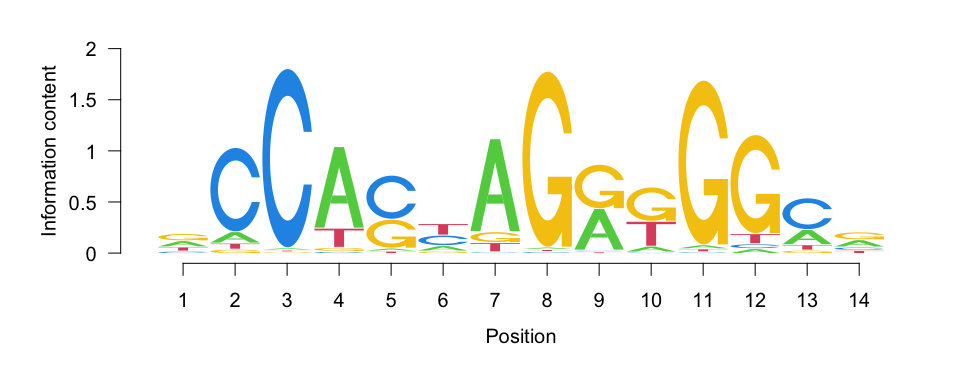
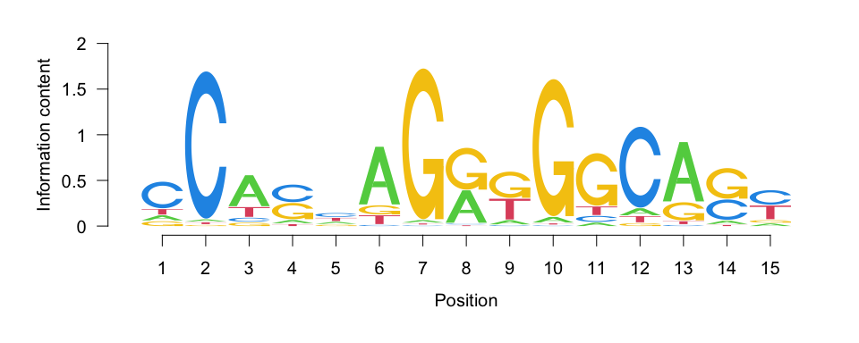
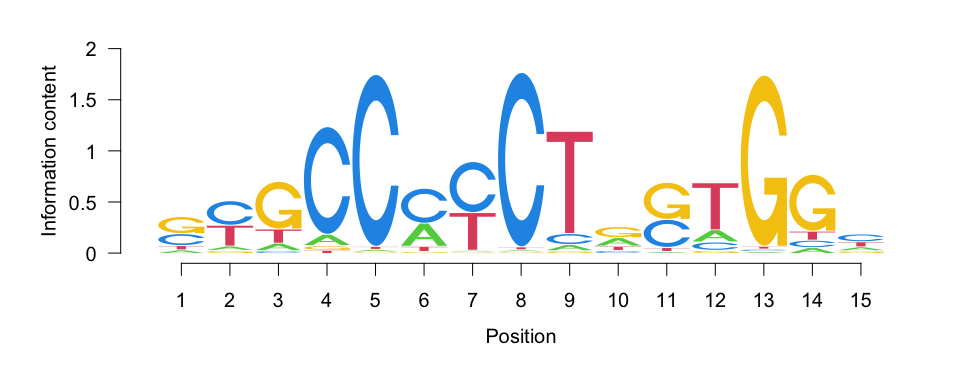
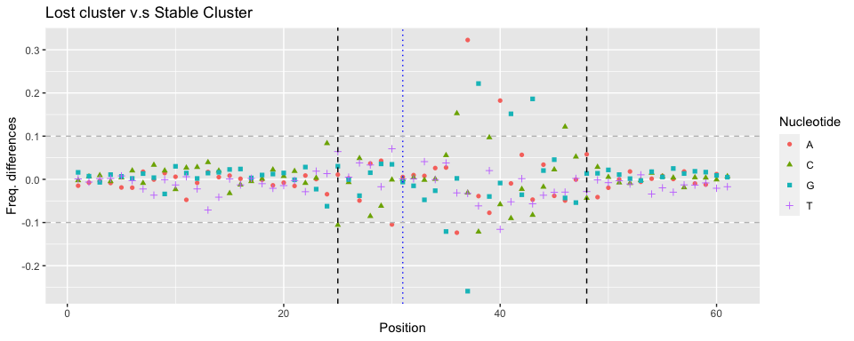
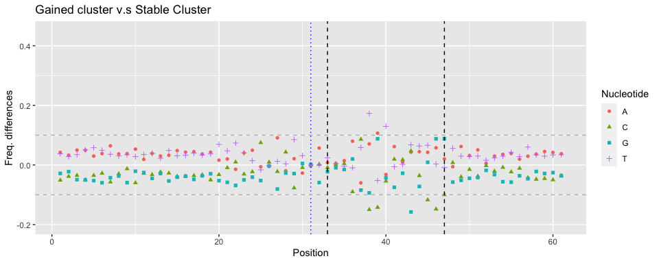
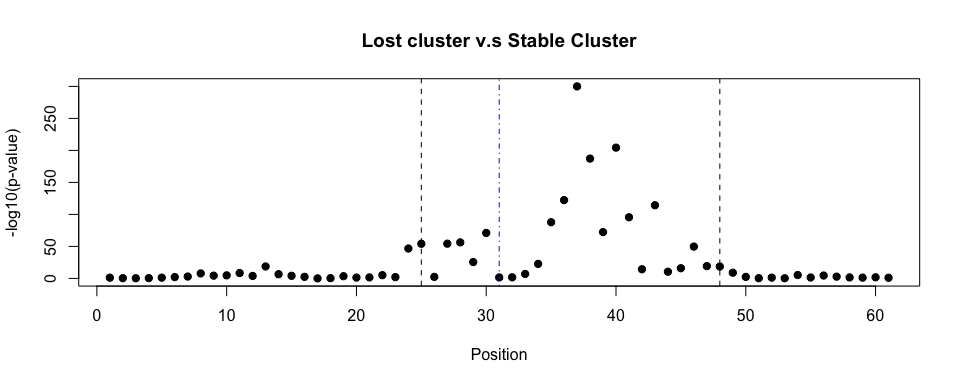
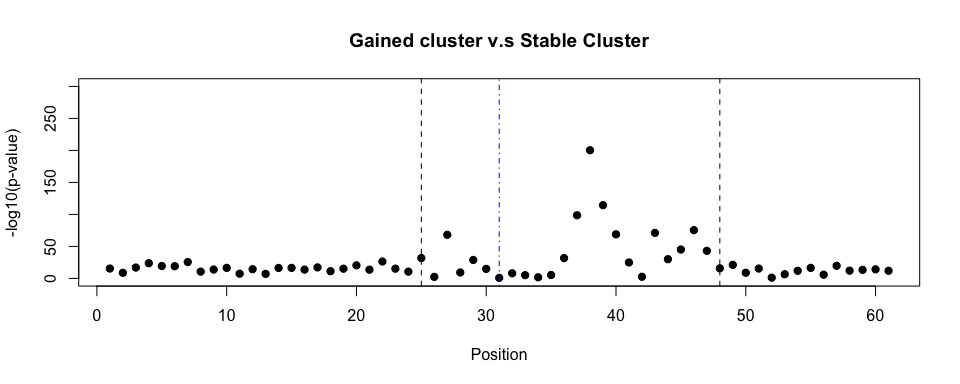
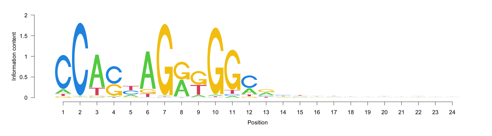
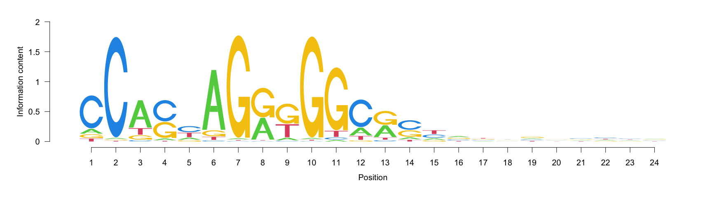
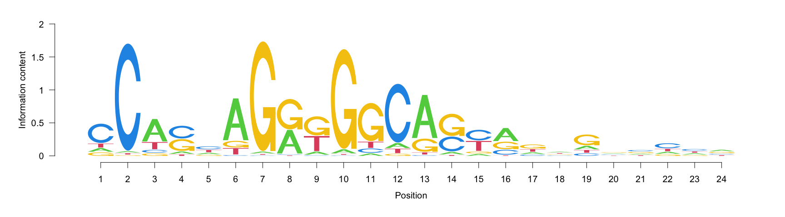

  


Motif identified in the Gained cluster

<!-- -->


Motif identified in the Lost cluster
<!-- -->


Motif identified in the Stable cluster
<!-- -->


# Frequency Difference Plot


## **Lost** v.s. **Stable**

<!-- -->

Fig 18: Difference of nucleotide differences between the **Lost** and **Stable** clusters. Black dashed lines (at position 25 and 48) are the boundaries of the region with frequency differences greater than 10% between the Lost cluster and the stable cluster

Table: Nucleotide frequences at positions with Freq. differences greater than 10% between the **Lost** and **Stable** clusters.


```
##    Nucleotide Position    Gained    Stable       Lost lost-stable Gained-stable
## 1           A       37 0.3473923 0.4074833 0.73007563   0.3225923   -0.06009105
## 2           G       37 0.3970522 0.4815479 0.22265852  -0.2588894   -0.08449577
## 3           G       38 0.2376417 0.3314967 0.55322862   0.2217320   -0.09385495
## 4           G       43 0.2104308 0.3682727 0.55453752   0.1862648   -0.15784184
## 5           A       40 0.2868481 0.3188109 0.50116347   0.1823526   -0.03196279
## 6           C       36 0.5952381 0.6851615 0.83784177   0.1526803   -0.08992336
## 7           G       41 0.2058957 0.2810097 0.43266434   0.1516546   -0.07511405
## 8           A       36 0.2732426 0.1936187 0.07009889  -0.1235198    0.07962397
## 9           C       46 0.1954649 0.3436699 0.46538685   0.1217169   -0.14820506
## 10          C       38 0.3380952 0.4879549 0.36649215  -0.1214627   -0.14985966
## 11          G       35 0.8539683 0.8690415 0.74825480  -0.1207867   -0.01507326
## 12          T       40 0.2668934 0.1372373 0.02152414  -0.1157132    0.12965611
## 13          C       25 0.8179138 0.7430805 0.63743455  -0.1056459    0.07483336
## 14          A       30 0.8306122 0.8577652 0.75319953  -0.1045657   -0.02715300
```


## **Gained** v.s. **Stable**

<!-- -->

Fig 19: Difference of nucleotide differences between the **Lost** and **Stable** clusters. Black dashed lines (at position 33 and 47) are the boundaries of the region with frequency differences greater than 10% between the Gained cluster and the Stable cluster.

Table: Nucleotide frequences at positions with Freq. differences greater than 10% between the Gained cluster and the Stable cluster.


```
##   Nucleotide Position    Gained     Stable       Lost lost-stable Gained-stable
## 1          T       38 0.2544218 0.08136853 0.01992437 -0.06144415     0.1730532
## 2          G       43 0.2104308 0.36827268 0.55453752  0.18626484    -0.1578418
## 3          C       38 0.3380952 0.48795489 0.36649215 -0.12146275    -0.1498597
## 4          C       46 0.1954649 0.34366991 0.46538685  0.12171694    -0.1482051
## 5          C       39 0.1975057 0.33982573 0.43673647  0.09691074    -0.1423201
## 6          T       40 0.2668934 0.13723731 0.02152414 -0.11571317     0.1296561
## 7          C       45 0.2099773 0.32713993 0.34976731  0.02262738    -0.1171626
## 8          A       39 0.2603175 0.15351102 0.07606166 -0.07744936     0.1068064
```


# Plots of the p-values from the Chi-square test


## Lost vs Stable

<!-- -->

## Gained vs. Stable

<!-- -->


# Consensus in the identified window


## Gained 


<!-- -->


## Stable


<!-- -->


## Lost


<!-- -->


