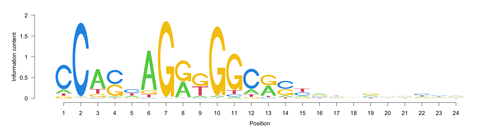

  


Motif identified in the TAD cluster

<!-- -->


Motif identified in the subTAD cluster
<!-- -->


Motif identified in the noTAD cluster
<!-- -->


```
## [1] "~/Documents/Packages/diffMotif/vignette/Step_7_TAD_comparison/Data/CTCF_TAD_4915.bed"
```


```
## Error in .Call2("C_solve_user_SEW", refwidths, start, end, width, translate.negative.coord,  : 
##   solving row 1: the supplied start/end lead to a negative width
## Error in .Call2("C_solve_user_SEW", refwidths, start, end, width, translate.negative.coord,  : 
##   solving row 1: the supplied start/end lead to a negative width
## Error in .Call2("C_solve_user_SEW", refwidths, start, end, width, translate.negative.coord,  : 
##   solving row 1: the supplied start/end lead to a negative width
## Error in .Call2("C_solve_user_SEW", refwidths, start, end, width, translate.negative.coord,  : 
##   solving row 1: the supplied start/end lead to a negative width
## Error in .Call2("C_solve_user_SEW", refwidths, start, end, width, translate.negative.coord,  : 
##   solving row 1: the supplied start/end lead to a negative width
## Error in .Call2("C_solve_user_SEW", refwidths, start, end, width, translate.negative.coord,  : 
##   solving row 1: the supplied start/end lead to a negative width
## Error in .Call2("C_solve_user_SEW", refwidths, start, end, width, translate.negative.coord,  : 
##   solving row 1: the supplied start/end lead to a negative width
```

```
## Error in .Call2("C_solve_user_SEW", refwidths, start, end, width, translate.negative.coord,  : 
##   solving row 1: the supplied start/end lead to a negative width
```

```
## Error in .Call2("C_solve_user_SEW", refwidths, start, end, width, translate.negative.coord,  : 
##   solving row 1: the supplied start/end lead to a negative width
## Error in .Call2("C_solve_user_SEW", refwidths, start, end, width, translate.negative.coord,  : 
##   solving row 1: the supplied start/end lead to a negative width
## Error in .Call2("C_solve_user_SEW", refwidths, start, end, width, translate.negative.coord,  : 
##   solving row 1: the supplied start/end lead to a negative width
## Error in .Call2("C_solve_user_SEW", refwidths, start, end, width, translate.negative.coord,  : 
##   solving row 1: the supplied start/end lead to a negative width
## Error in .Call2("C_solve_user_SEW", refwidths, start, end, width, translate.negative.coord,  : 
##   solving row 1: the supplied start/end lead to a negative width
## Error in .Call2("C_solve_user_SEW", refwidths, start, end, width, translate.negative.coord,  : 
##   solving row 1: the supplied start/end lead to a negative width
```


# Frequency Difference Plot


## **SubTab** v.s. **Tab**

<!-- -->

Fig 18: Difference of nucleotide differences between the **Lost** and **Stable** clusters. Black dashed lines (at position 25 and 48) are the boundaries of the region with frequency differences greater than 10% between the Lost cluster and the stable cluster

Table: Nucleotide frequences at positions with Freq. differences greater than 10% between the **Lost** and **Stable** clusters.


```
## [1] Nucleotide   Position     TAD          subTAD       noTAD       
## [6] subtad-tad   tad-notad    subtad-notad
## <0 rows> (or 0-length row.names)
```


## **TAD** v.s. **noTAD**

<!-- -->

Fig 19: Difference of nucleotide differences between the **Lost** and **Stable** clusters. Black dashed lines (at position 33 and 47) are the boundaries of the region with frequency differences greater than 10% between the Gained cluster and the Stable cluster.

Table: Nucleotide frequences at positions with Freq. differences greater than 10% between the Gained cluster and the Stable cluster.


```
##   Nucleotide Position        TAD     subTAD     noTAD    subtad-tad   tad-notad
## 1          C       36 0.73540146 0.70638221 0.6628608 -0.0290192505  0.07254062
## 2          C       28 0.52864964 0.52070150 0.4605773 -0.0079481344  0.06807230
## 3          T       38 0.05273723 0.05930212 0.1189143  0.0065648891 -0.06617703
## 4          C       38 0.46551095 0.48671126 0.4024128  0.0212003149  0.06309820
## 5          T       40 0.07627737 0.11896583 0.1339940  0.0426884567 -0.05771660
## 6          T       27 0.14507299 0.15910324 0.1996984  0.0140302436 -0.05462541
## 7          G       38 0.38886861 0.36503345 0.3367083 -0.0238351653  0.05216030
## 8          T       39 0.39744526 0.39775809 0.3464024  0.0003128353  0.05104284
##   subtad-notad
## 1   0.04352137
## 2   0.06012416
## 3  -0.05961215
## 4   0.08429851
## 5  -0.01502814
## 6  -0.04059517
## 7   0.02832513
## 8   0.05135568
```

## **subTAD** v.s. **noTAD**

<!-- -->

Fig 19: Difference of nucleotide differences between the **Lost** and **Stable** clusters. Black dashed lines (at position 33 and 47) are the boundaries of the region with frequency differences greater than 10% between the Gained cluster and the Stable cluster.

Table: Nucleotide frequences at positions with Freq. differences greater than 10% between the Gained cluster and the Stable cluster.


```
##   Nucleotide Position        TAD     subTAD     noTAD    subtad-tad   tad-notad
## 1          C       38 0.46551095 0.48671126 0.4024128  0.0212003149  0.06309820
## 2          C       28 0.52864964 0.52070150 0.4605773 -0.0079481344  0.06807230
## 3          T       38 0.05273723 0.05930212 0.1189143  0.0065648891 -0.06617703
## 4          G       39 0.11934307 0.10486350 0.1639380 -0.0144795690 -0.04459489
## 5          A       38 0.09288321 0.08895317 0.1419647 -0.0039300387 -0.04908146
## 6          T       39 0.39744526 0.39775809 0.3464024  0.0003128353  0.05104284
##   subtad-notad
## 1   0.08429851
## 2   0.06012416
## 3  -0.05961215
## 4  -0.05907446
## 5  -0.05301150
## 6   0.05135568
```
# Plots of the p-values from the Chi-square test


## subTAD vs TAD

<!-- -->

## TAD vs. noTAD


```
## [1] 31
```

<!-- -->

## subTAD vs. No TAD


```
## [1] 31
```

<!-- -->


# Consensus in the identified window


## TAD


<!-- -->


## noTAD


<!-- -->


## subTAD


<!-- -->


